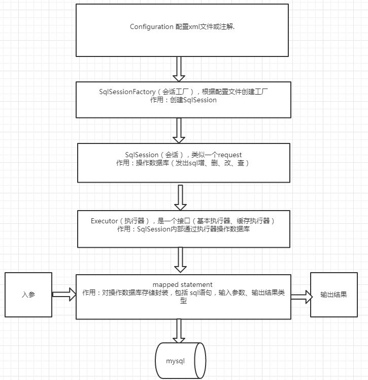

# Yu-Mybatis
手动实现一个简化版的mybatis

### Mybatis框架实现的流程

1. mybatis包含两种配置文件
   ```
    config.xml用于配置全局参数如数据库连接参数等；
    mapper.xml用于定义dao层的实现,包含sql语句等。
   ```
2. 通过config.xml的定义建立连接，获取会话工厂，从工厂中获取sqlSession
3. SqlSession通过Executor执行具体的语句
4. mappedStatement通过mapper.xml的定义生成，根据xml中的配置自动进行响应结果的映射


    
   
